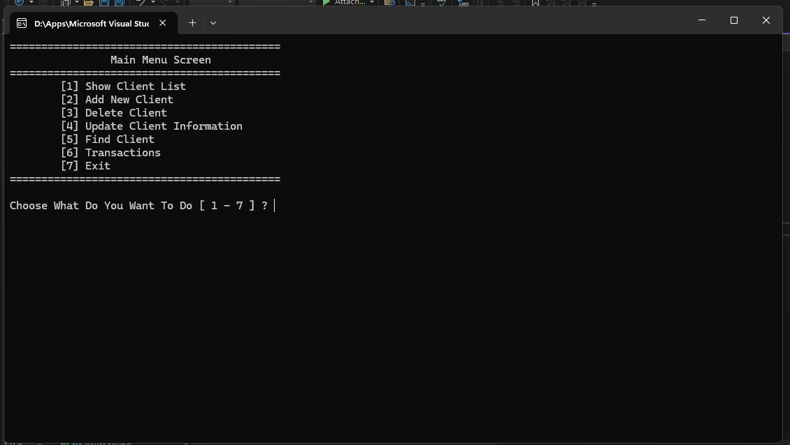
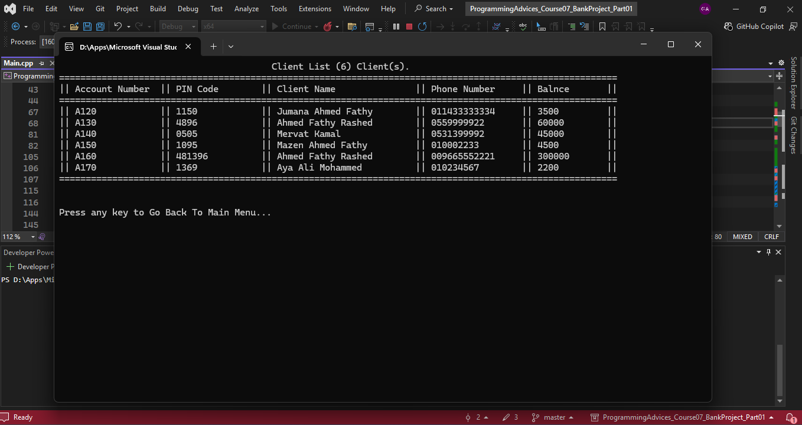
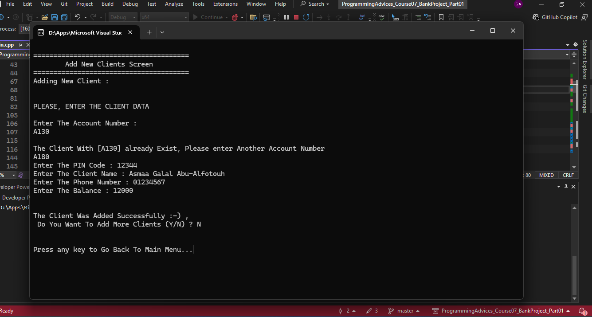
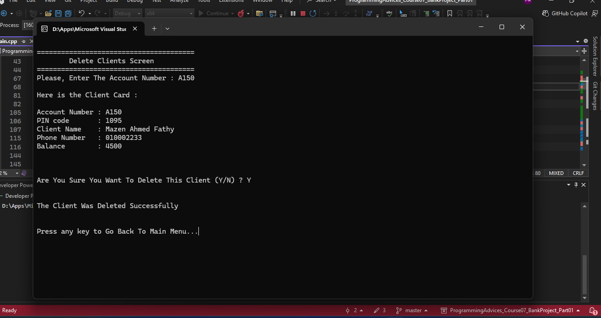
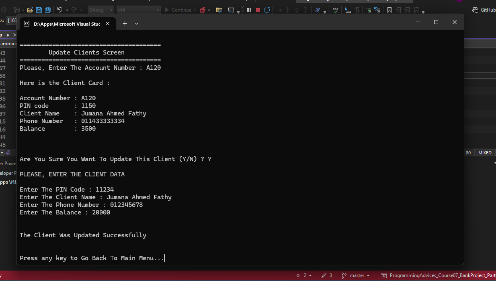
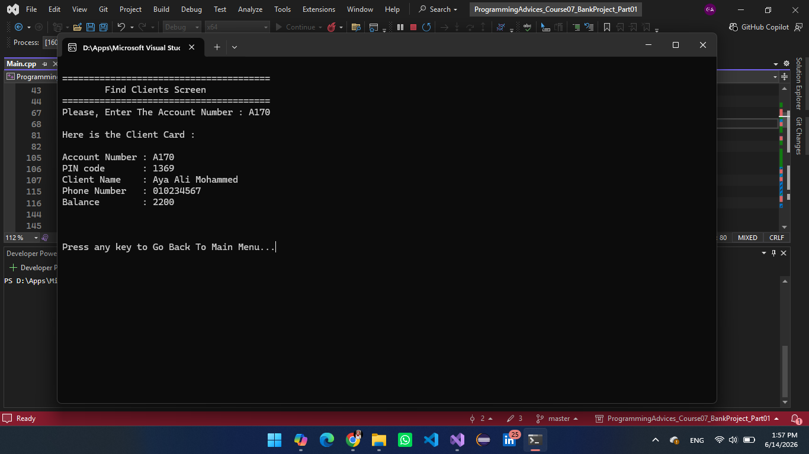
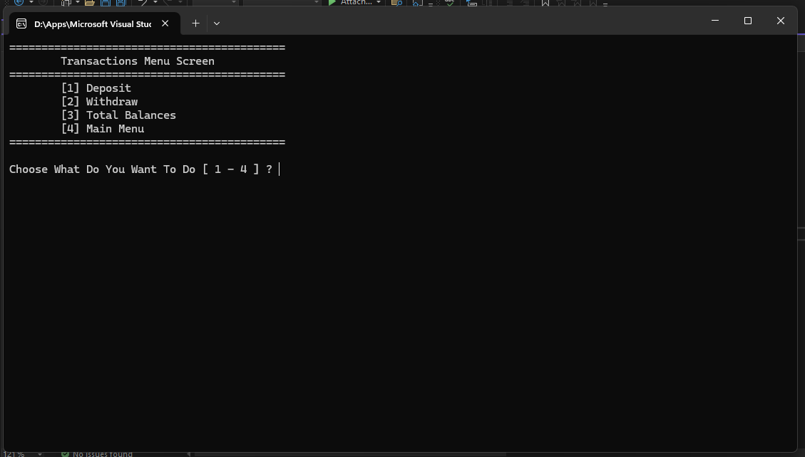
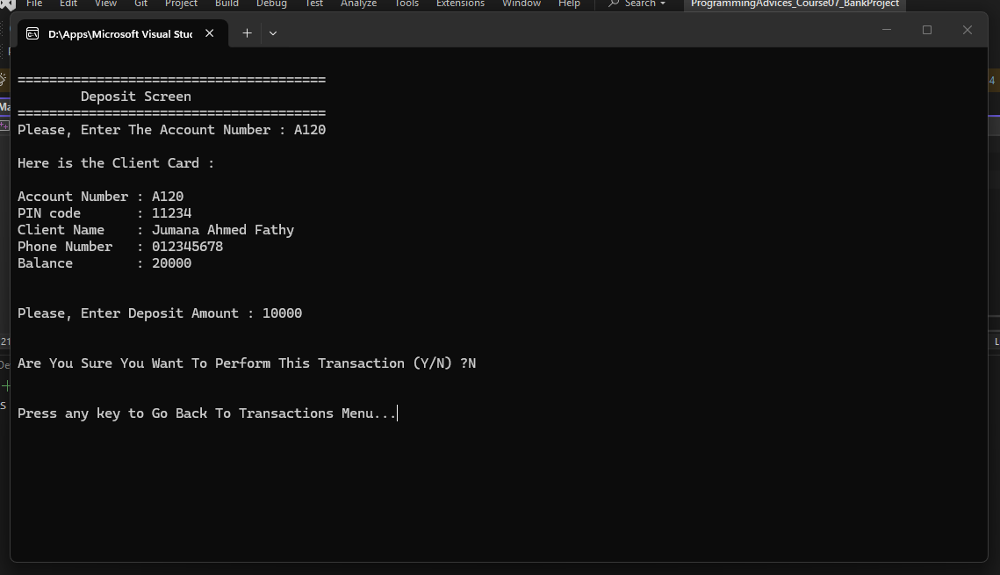
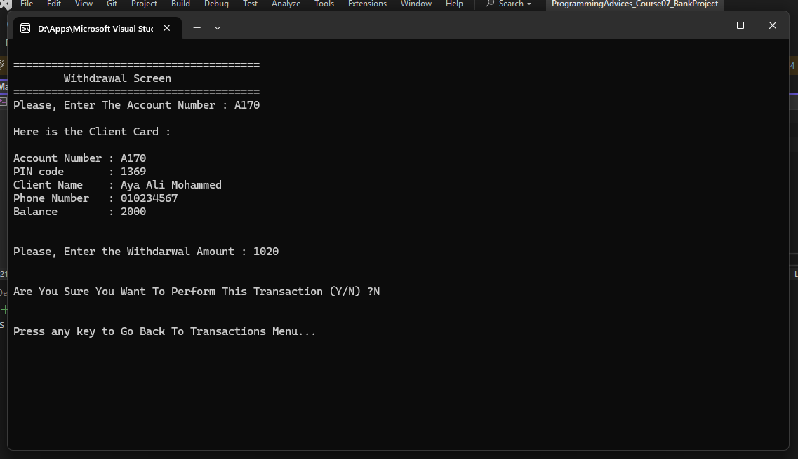
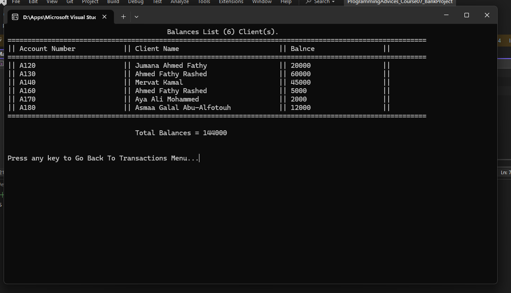

# 🏦 Bank Management System

A simple console-based banking system that demonstrates **CRUD operations**, **file handling**, and **basic banking transactions** using **C++**.

This project was developed as part of **Course 7** from **Mohammad Abu-Hadhoud's Programming Roadmap**. It allows users to manage bank clients, perform banking transactions, and store client data permanently using a text file.

---

## ✨ Features

- 📋 Display all clients
- ➕ Add a new client
- ✏️ Update client information
- ❌ Delete a client
- 🔍 Find a client by account number
- 💰 Deposit money into a client account
- 💸 Withdraw money from a client account
- 📊 Display all clients' balances
- 💵 Calculate the total balance of all clients
- 💾 Save client data using text files

---

## 📋 Client Information

Each client record contains:

- Account Number
- PIN Code
- Client Name
- Phone Number
- Account Balance

---

## 💾 Data Storage

The application stores all client records in a text file named:

```text
ClientData.txt
```

Each record is stored using the following format:

```text
AccountNumber$||$PinCode$||$ClientName$||$PhoneNumber$||$Balance
```

The custom separator (`$||$`) is used to simplify reading and writing records.

---

## 🛠️ Technologies Used

- C++
- Standard Template Library (STL)
- File Handling (`fstream`)
- Vectors
- Structures (`struct`)
- Enumerations (`enum`)
- Modular Programming

---

## 📚 Concepts Practiced

This project helped me practice:

- Functions
- File Handling
- Structures
- Enumerations
- Vectors
- CRUD Operations
- Menu-Driven Applications
- Data Serialization
- Passing by Reference
- Input Validation
- Clean Code Organization

---

## 📂 Project Structure

```text
Bank-Management-System/
│
├── main.cpp
├── ClientData.txt
├── README.md
└── images/
```

---

## 📸 Screenshots

### Main Menu



### Client List



### Add New Client



### Delete Client



### Update Client Information



### Find Client



### Transactions Menu



### Deposit



### Withdraw



### Total Balances


---

## ▶️ How to Run

1. Clone the repository.

```bash
https://github.com/GomanaAhmed2025/ProgrammingAdvices_Course7_Bank-Management-System.git```

2. Open the project using any C++ IDE (Visual Studio, Visual Studio Code, Code::Blocks, or Dev-C++).

3. Build and run the project.

4. Make sure that `ClientData.txt` is located in the same directory as the executable file.

---

## 🚀 Future Improvements

Possible future enhancements include:

- User authentication
- Password encryption
- Money transfer between clients
- Transaction history
- Database integration (SQL)
- Object-Oriented Programming (OOP) version
- Graphical User Interface (GUI)

---

## 👩‍💻 Author

**Gomana Ahmed Fathy**

Computer Engineering Graduate

Project completed while following **Mohammad Abu-Hadhoud's Programming Roadmap (Course 7)**.